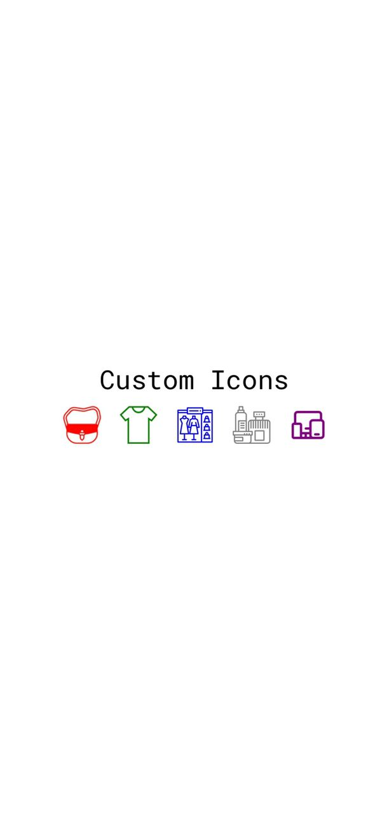

<!-- NAME OF THE PROJECT -->
## Custom Icons and Fonts in React Native for Enhanced User Experience.
<!-- Short description of project if you want -->
This repository serves as a complementary resource to the Medium article, offering further practical insights and support on the same topic.

---
<!-- TABLE OF CONTENTS -->
<details>
   <summary>Table of Contents</summary>
  <ol>
    <li>
      <a href="#about-the-project">About The Project</a>
    </li>
    <li>
      <a href="#getting-started">Getting Started</a>
      <ul>
        <li><a href="#prerequisites">Prerequisites</a></li>
        <li><a href="#installation">Installation</a></li>
      </ul>
    </li>
    <li><a href="#usage">Usage</a></li>
    <li><a href="#license">License</a></li>
    <li><a href="#acknowledgments">Author Info</a></li>
  </ol>
</details>

---
<!-- ABOUT THE PROJECT -->
## About The Project
This open-source repository provides extensive guidance and practical examples to assist React Native developers in gaining a thorough understanding of how to effectively utilize custom icons in their React Native applications.

<p align="right">[<a href="#project-name">back to top</a>]</p>

---

<!-- GETTING STARTED -->
## Getting Started


### Prerequisites
<!-- Guideline on installing software -->
To use the software, audience will need to install the necessary items. Provide a guide to help through the process.

* npm
  ```
  npm install npm@latest -g
  ```

### Installation

To provide instructions to your audience on installing and setting up your app, an example is as follows:

1. Clone the repository
   ```sh
   git clone https://github.com/Davidon4/Custom-icon.git
   ```
2. Install node module package
   ```sh
   yarn install
   ```
3. Start project
   ```sh
   expo start
   ```

<p align="right">[<a href="#project-name">back to top</a>]</p>

---

<!-- USAGE EXAMPLES -->
## Usage

In this space, you can provide useful examples of how your project can be utilized. This may include screenshots, code examples, demos, and links to additional resources. Additional materials such as these can help showcase the capabilities of your project.

<div align="center">

</div>

<p align="right">[<a href="#project-name">back to top</a>]</p>

---

<!-- LICENSE -->
## License

Licensed under the [MIT](https://github.com/Davidon4/Custom-icon/blob/main/LICENSE).

<p align="right">[<a href="#project-name">back to top</a>]</p>

---
<!-- Author -->
## Author Info

[](https://github.com/github_username)

<p align="right">[<a href="#project-name">back to top</a>]</p>
